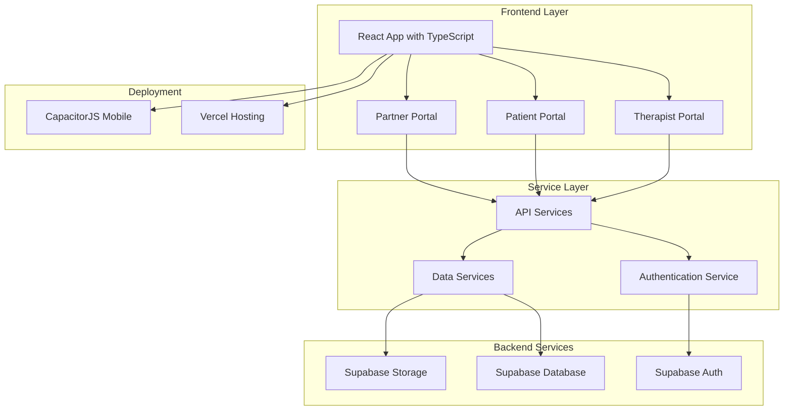

# Design Document

## Overview

The FisioFlow 2.0 infrastructure design establishes a modern, scalable foundation for a comprehensive physiotherapy clinic management system. The architecture leverages React 19.1.1 with TypeScript, Supabase as Backend-as-a-Service, and Vercel for deployment, creating a robust platform that can serve multiple user portals while maintaining performance and security.

## Architecture

### High-Level Architecture



### Technology Stack Integration

- **Frontend**: React 19.1.1 with TypeScript for type safety and modern React features
- **Build Tool**: Vite for fast development and optimized production builds
- **Styling**: Tailwind CSS for utility-first styling approach
- **Backend**: Supabase providing PostgreSQL database, authentication, and file storage
- **Deployment**: Vercel for automatic deployments with Git integration
- **Mobile**: CapacitorJS for iOS app wrapper
- **Forms**: React Hook Form with Zod validation for robust form handling
- **Routing**: React Router DOM with HashRouter for SPA navigation

## Components and Interfaces

### Project Structure

```
src/
├── components/           # Reusable UI components
│   ├── ui/              # Generic UI components (Button, Modal, Card)
│   ├── forms/           # Form-specific components
│   ├── dashboard/       # Dashboard widgets
│   ├── patient-portal/  # Patient-specific components
│   └── partner-portal/  # Partner-specific components
├── pages/               # Page components
│   ├── patient-portal/  # Patient portal pages
│   └── partner-portal/  # Partner portal pages
├── services/            # API service layer
│   ├── supabase/       # Supabase client configuration
│   └── api/            # API service implementations
├── hooks/               # Custom React hooks
├── contexts/            # React Context providers
├── layouts/             # Layout components
├── types/               # TypeScript type definitions
└── utils/               # Utility functions
```

### Core Service Interfaces

```typescript
// Supabase Client Interface
interface SupabaseService {
  client: SupabaseClient;
  auth: AuthService;
  database: DatabaseService;
  storage: StorageService;
}

// Authentication Service Interface
interface AuthService {
  signIn(email: string, password: string): Promise<AuthResponse>;
  signUp(userData: UserRegistration): Promise<AuthResponse>;
  signOut(): Promise<void>;
  getCurrentUser(): Promise<User | null>;
  updateProfile(updates: ProfileUpdate): Promise<void>;
}

// Database Service Interface
interface DatabaseService {
  select<T>(table: string, query?: QueryOptions): Promise<T[]>;
  insert<T>(table: string, data: Partial<T>): Promise<T>;
  update<T>(table: string, id: string, data: Partial<T>): Promise<T>;
  delete(table: string, id: string): Promise<void>;
}
```

### UI Component Architecture

```typescript
// Generic Button Component
interface ButtonProps {
  variant: 'primary' | 'secondary' | 'danger';
  size: 'sm' | 'md' | 'lg';
  disabled?: boolean;
  loading?: boolean;
  onClick?: () => void;
  children: React.ReactNode;
}

// Modal Component
interface ModalProps {
  isOpen: boolean;
  onClose: () => void;
  title: string;
  size?: 'sm' | 'md' | 'lg' | 'xl';
  children: React.ReactNode;
}

// Form Component with Validation
interface FormProps<T> {
  schema: ZodSchema<T>;
  onSubmit: (data: T) => Promise<void>;
  defaultValues?: Partial<T>;
  children: React.ReactNode;
}
```

## Data Models

### User Management

```typescript
interface User {
  id: string;
  email: string;
  role: 'therapist' | 'patient' | 'partner' | 'admin';
  profile: UserProfile;
  createdAt: Date;
  updatedAt: Date;
}

interface UserProfile {
  firstName: string;
  lastName: string;
  phone?: string;
  avatar?: string;
  preferences: UserPreferences;
}

interface UserPreferences {
  language: 'pt-BR' | 'en-US';
  timezone: string;
  notifications: NotificationSettings;
}
```

### Database Schema Foundation

```sql
-- Users table (extends Supabase auth.users)
CREATE TABLE profiles (
  id UUID REFERENCES auth.users(id) PRIMARY KEY,
  role TEXT NOT NULL CHECK (role IN ('therapist', 'patient', 'partner', 'admin')),
  first_name TEXT NOT NULL,
  last_name TEXT NOT NULL,
  phone TEXT,
  avatar TEXT,
  preferences JSONB DEFAULT '{}',
  created_at TIMESTAMP WITH TIME ZONE DEFAULT NOW(),
  updated_at TIMESTAMP WITH TIME ZONE DEFAULT NOW()
);

-- Enable Row Level Security
ALTER TABLE profiles ENABLE ROW LEVEL SECURITY;

-- Create policies for data access
CREATE POLICY "Users can view own profile" ON profiles
  FOR SELECT USING (auth.uid() = id);

CREATE POLICY "Users can update own profile" ON profiles
  FOR UPDATE USING (auth.uid() = id);
```

## Error Handling

### Error Boundary Implementation

```typescript
interface ErrorBoundaryState {
  hasError: boolean;
  error?: Error;
  errorInfo?: ErrorInfo;
}

class ErrorBoundary extends Component<PropsWithChildren, ErrorBoundaryState> {
  // Error boundary implementation with logging to Supabase
  // Graceful fallback UI for different error types
  // Integration with toast notifications for user feedback
}
```

### API Error Handling

```typescript
interface ApiError {
  code: string;
  message: string;
  details?: any;
  timestamp: Date;
}

class ApiErrorHandler {
  static handle(error: any): ApiError {
    // Standardized error handling for Supabase errors
    // User-friendly error messages in Portuguese
    // Automatic retry logic for transient errors
    // Error logging and monitoring
  }
}
```

## Testing Strategy

### Testing Framework Setup

- **Unit Testing**: Vitest for fast unit tests of components and services
- **Integration Testing**: Testing Library React for component integration tests
- **E2E Testing**: Playwright for end-to-end testing of critical user flows
- **API Testing**: Supabase client testing with mock data

### Test Structure

```typescript
// Component Testing Example
describe('Button Component', () => {
  it('should render with correct variant styles', () => {
    // Test implementation
  });
  
  it('should handle loading state correctly', () => {
    // Test implementation
  });
});

// Service Testing Example
describe('AuthService', () => {
  it('should authenticate user successfully', async () => {
    // Test implementation with mocked Supabase client
  });
});
```

### Testing Configuration

- Mock Supabase client for isolated testing
- Test data factories for consistent test data
- Coverage reporting with minimum thresholds
- Automated testing in CI/CD pipeline

## Security Considerations

### Authentication & Authorization

- Supabase Auth integration with JWT tokens
- Role-based access control (RBAC) implementation
- Protected routes for different user portals
- Session management and automatic token refresh

### Data Protection (LGPD Compliance)

- Data encryption at rest and in transit
- User consent management for data processing
- Data retention policies and automated cleanup
- Audit logging for data access and modifications
- User rights implementation (access, rectification, deletion)

### Security Headers and Policies

```typescript
// Content Security Policy
const cspPolicy = {
  'default-src': ["'self'"],
  'script-src': ["'self'", "'unsafe-inline'", "https://cdn.supabase.co"],
  'style-src': ["'self'", "'unsafe-inline'"],
  'img-src': ["'self'", "data:", "https:"],
  'connect-src': ["'self'", "https://*.supabase.co"]
};
```

## Performance Optimization

### Code Splitting and Lazy Loading

```typescript
// Route-based code splitting
const TherapistPortal = lazy(() => import('./pages/TherapistPortal'));
const PatientPortal = lazy(() => import('./pages/PatientPortal'));
const PartnerPortal = lazy(() => import('./pages/PartnerPortal'));

// Component-based lazy loading for heavy components
const AppointmentCalendar = lazy(() => import('./components/AppointmentCalendar'));
```

### Caching Strategy

- React Query for server state management and caching
- Service Worker for offline functionality
- Supabase real-time subscriptions for live data updates
- Image optimization and lazy loading

### Bundle Optimization

- Vite's built-in tree shaking and minification
- Dynamic imports for feature-based code splitting
- Asset optimization and compression
- CDN integration for static assets