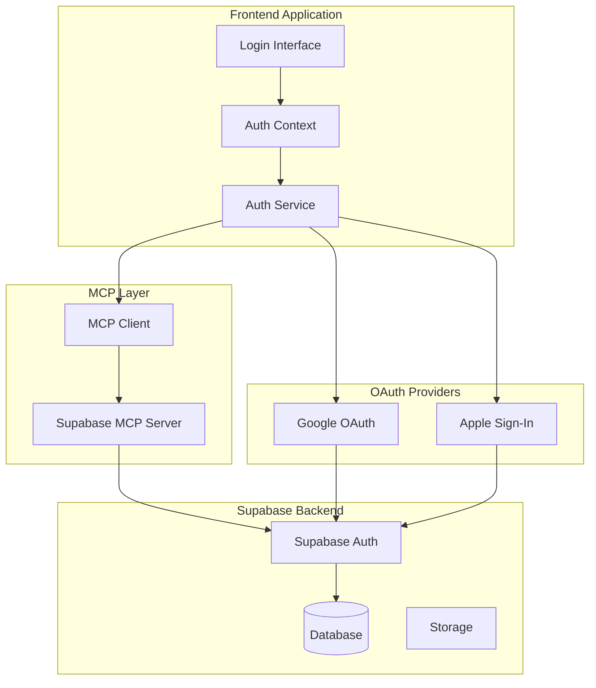
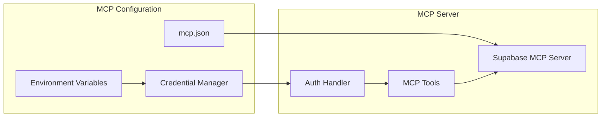

# Design Document

## Overview

Este documento apresenta o design técnico para a integração completa do MCP da Supabase e sistema de autenticação multi-provedor no FisioFlow 2.0. A solução implementará uma arquitetura robusta e segura que suporta autenticação via email/senha, Google OAuth e Apple Sign-In, utilizando o Model Context Protocol (MCP) para comunicação otimizada com a Supabase.

## Architecture

### High-Level Architecture



### MCP Configuration Architecture



## Components and Interfaces

### 1. MCP Configuration Service

```typescript
interface MCPSupabaseConfig {
  projectRef: string;
  accessToken: string;
  readOnly: boolean;
  logLevel: 'DEBUG' | 'INFO' | 'WARN' | 'ERROR';
  autoApprove: string[];
}

interface MCPConfigService {
  initializeSupabaseMCP(): Promise<void>;
  updateConfiguration(config: Partial<MCPSupabaseConfig>): Promise<void>;
  validateConnection(): Promise<boolean>;
  getAvailableTools(): Promise<string[]>;
}
```

### 2. Enhanced Auth Service

```typescript
interface AuthProvider {
  id: 'email' | 'google' | 'apple';
  name: string;
  enabled: boolean;
  config: Record<string, any>;
}

interface AuthenticationService {
  // Email/Password Authentication
  signInWithEmail(email: string, password: string): Promise<AuthResult>;
  signUpWithEmail(userData: EmailSignUpData): Promise<AuthResult>;
  
  // OAuth Authentication
  signInWithGoogle(): Promise<AuthResult>;
  signInWithApple(): Promise<AuthResult>;
  
  // Session Management
  getCurrentSession(): Promise<Session | null>;
  refreshSession(): Promise<Session>;
  signOut(): Promise<void>;
  
  // Password Management
  resetPassword(email: string): Promise<void>;
  updatePassword(newPassword: string): Promise<void>;
  
  // Profile Management
  updateProfile(updates: ProfileUpdates): Promise<User>;
  
  // Provider Management
  getAvailableProviders(): Promise<AuthProvider[]>;
  linkProvider(provider: 'google' | 'apple'): Promise<void>;
  unlinkProvider(provider: 'google' | 'apple'): Promise<void>;
}
```

### 3. OAuth Integration Components

```typescript
interface GoogleAuthConfig {
  clientId: string;
  redirectUri: string;
  scopes: string[];
}

interface AppleAuthConfig {
  clientId: string;
  redirectUri: string;
  scope: string;
  responseType: 'code' | 'id_token';
  responseMode: 'query' | 'fragment' | 'form_post';
}

interface OAuthHandler {
  initializeProvider(provider: 'google' | 'apple'): Promise<void>;
  handleCallback(provider: 'google' | 'apple', code: string): Promise<AuthResult>;
  refreshToken(provider: 'google' | 'apple', refreshToken: string): Promise<TokenResult>;
}
```

### 4. Security and Session Management

```typescript
interface SecurityConfig {
  sessionTimeout: number;
  refreshTokenRotation: boolean;
  maxLoginAttempts: number;
  lockoutDuration: number;
  passwordPolicy: PasswordPolicy;
}

interface SessionManager {
  createSession(user: User, provider: string): Promise<Session>;
  validateSession(sessionToken: string): Promise<boolean>;
  refreshSession(refreshToken: string): Promise<Session>;
  revokeSession(sessionId: string): Promise<void>;
  cleanupExpiredSessions(): Promise<void>;
}
```

## Data Models

### User Profile Model

```typescript
interface User {
  id: string;
  email: string;
  name: string;
  role: Role;
  avatarUrl?: string;
  phone?: string;
  
  // Provider-specific data
  providers: {
    email?: {
      verified: boolean;
      lastLogin: Date;
    };
    google?: {
      googleId: string;
      picture: string;
      verified: boolean;
    };
    apple?: {
      appleId: string;
      privateEmail?: string;
      realUserStatus: 'likely_real' | 'unknown';
    };
  };
  
  // Security metadata
  security: {
    lastLogin: Date;
    loginAttempts: number;
    lockedUntil?: Date;
    twoFactorEnabled: boolean;
  };
  
  // Audit fields
  createdAt: Date;
  updatedAt: Date;
  lastActiveAt: Date;
}
```

### Session Model

```typescript
interface Session {
  id: string;
  userId: string;
  provider: 'email' | 'google' | 'apple';
  accessToken: string;
  refreshToken: string;
  expiresAt: Date;
  createdAt: Date;
  lastUsedAt: Date;
  deviceInfo: {
    userAgent: string;
    ipAddress: string;
    platform: string;
  };
}
```

### Authentication Result Model

```typescript
interface AuthResult {
  success: boolean;
  user?: User;
  session?: Session;
  error?: {
    code: string;
    message: string;
    details?: Record<string, any>;
  };
  requiresVerification?: boolean;
  requiresAdditionalInfo?: boolean;
}
```

## Error Handling

### Error Classification

```typescript
enum AuthErrorCode {
  // General errors
  INVALID_CREDENTIALS = 'invalid_credentials',
  USER_NOT_FOUND = 'user_not_found',
  EMAIL_ALREADY_EXISTS = 'email_already_exists',
  
  // Session errors
  SESSION_EXPIRED = 'session_expired',
  INVALID_SESSION = 'invalid_session',
  SESSION_LIMIT_EXCEEDED = 'session_limit_exceeded',
  
  // OAuth errors
  OAUTH_CANCELLED = 'oauth_cancelled',
  OAUTH_ERROR = 'oauth_error',
  PROVIDER_NOT_AVAILABLE = 'provider_not_available',
  
  // Security errors
  ACCOUNT_LOCKED = 'account_locked',
  TOO_MANY_ATTEMPTS = 'too_many_attempts',
  WEAK_PASSWORD = 'weak_password',
  
  // MCP errors
  MCP_CONNECTION_FAILED = 'mcp_connection_failed',
  MCP_UNAUTHORIZED = 'mcp_unauthorized',
  MCP_RATE_LIMITED = 'mcp_rate_limited',
}

interface AuthError extends Error {
  code: AuthErrorCode;
  details?: Record<string, any>;
  retryable: boolean;
  userMessage: string;
}
```

### Error Recovery Strategies

```typescript
interface ErrorRecoveryStrategy {
  canRecover(error: AuthError): boolean;
  recover(error: AuthError): Promise<AuthResult>;
  getRetryDelay(attempt: number): number;
  getMaxRetries(): number;
}

class AuthErrorHandler {
  private strategies: Map<AuthErrorCode, ErrorRecoveryStrategy>;
  
  async handleError(error: AuthError): Promise<AuthResult> {
    const strategy = this.strategies.get(error.code);
    if (strategy && strategy.canRecover(error)) {
      return await strategy.recover(error);
    }
    throw error;
  }
}
```

## Testing Strategy

### Unit Testing

1. **Auth Service Tests**
   - Test all authentication methods (email, Google, Apple)
   - Mock MCP client interactions
   - Test error handling and recovery
   - Validate session management

2. **MCP Integration Tests**
   - Test MCP configuration and connection
   - Validate tool availability and execution
   - Test error scenarios and fallbacks

3. **OAuth Flow Tests**
   - Mock OAuth provider responses
   - Test callback handling
   - Validate token refresh logic

### Integration Testing

1. **End-to-End Authentication Flows**
   - Complete login/logout cycles
   - Provider switching scenarios
   - Session persistence across page reloads

2. **Security Testing**
   - Rate limiting validation
   - Session security tests
   - CSRF protection verification

3. **Performance Testing**
   - Authentication response times
   - MCP connection performance
   - Concurrent user scenarios

### Test Data Management

```typescript
interface TestAuthData {
  users: {
    valid: User[];
    invalid: Partial<User>[];
    locked: User[];
  };
  sessions: {
    valid: Session[];
    expired: Session[];
    invalid: Session[];
  };
  oauthResponses: {
    google: {
      success: any[];
      error: any[];
    };
    apple: {
      success: any[];
      error: any[];
    };
  };
}
```

## Security Considerations

### Authentication Security

1. **Password Security**
   - Minimum 8 characters with complexity requirements
   - Bcrypt hashing with salt rounds ≥ 12
   - Password history to prevent reuse

2. **Session Security**
   - JWT tokens with short expiration (15 minutes)
   - Secure refresh token rotation
   - HttpOnly cookies for token storage

3. **OAuth Security**
   - PKCE for OAuth flows
   - State parameter validation
   - Nonce validation for OpenID Connect

### Data Protection (LGPD Compliance)

1. **Data Minimization**
   - Collect only necessary user data
   - Regular data cleanup for inactive accounts
   - Explicit consent for data processing

2. **Data Security**
   - Encryption at rest and in transit
   - Regular security audits
   - Access logging and monitoring

3. **User Rights**
   - Data portability features
   - Account deletion capabilities
   - Consent management interface

## Performance Optimization

### Caching Strategy

```typescript
interface AuthCacheStrategy {
  sessionCache: {
    ttl: number;
    maxSize: number;
    strategy: 'LRU' | 'LFU';
  };
  userProfileCache: {
    ttl: number;
    invalidationTriggers: string[];
  };
  oauthTokenCache: {
    ttl: number;
    encryptionEnabled: boolean;
  };
}
```

### Connection Pooling

1. **MCP Connection Management**
   - Connection pooling for Supabase MCP
   - Automatic reconnection with exponential backoff
   - Health checks and monitoring

2. **Database Optimization**
   - Prepared statements for common queries
   - Connection reuse across requests
   - Query optimization for user lookups

## Deployment Configuration

### Environment Variables

```bash
# Supabase Configuration
VITE_SUPABASE_URL=https://your-project.supabase.co
VITE_SUPABASE_ANON_KEY=your-anon-key
SUPABASE_ACCESS_TOKEN=your-access-token
SUPABASE_PROJECT_REF=your-project-ref

# OAuth Configuration
VITE_GOOGLE_CLIENT_ID=your-google-client-id
VITE_APPLE_CLIENT_ID=your-apple-client-id

# Security Configuration
JWT_SECRET=your-jwt-secret
SESSION_TIMEOUT=900000
REFRESH_TOKEN_ROTATION=true

# MCP Configuration
MCP_LOG_LEVEL=INFO
FASTMCP_LOG_LEVEL=ERROR
```

### MCP Server Configuration

```json
{
  "mcpServers": {
    "supabase": {
      "command": "cmd",
      "args": [
        "/c",
        "npx",
        "-y",
        "@supabase/mcp-server-supabase@latest",
        "--read-only",
        "--project-ref=${SUPABASE_PROJECT_REF}"
      ],
      "env": {
        "SUPABASE_ACCESS_TOKEN": "${SUPABASE_ACCESS_TOKEN}",
        "MCP_LOG_LEVEL": "INFO",
        "FASTMCP_LOG_LEVEL": "ERROR"
      },
      "disabled": false,
      "autoApprove": [
        "query",
        "get-user",
        "get-session",
        "list-tables",
        "describe-table"
      ]
    }
  }
}
```

## Migration Strategy

### Phase 1: MCP Setup
- Configure Supabase MCP server
- Test basic connectivity and tools
- Implement credential management

### Phase 2: Enhanced Email Auth
- Upgrade existing email authentication
- Add password reset functionality
- Implement session management

### Phase 3: OAuth Integration
- Add Google OAuth support
- Implement Apple Sign-In
- Test provider linking/unlinking

### Phase 4: Security Hardening
- Implement rate limiting
- Add audit logging
- Security testing and validation

### Phase 5: Performance Optimization
- Implement caching strategies
- Optimize database queries
- Load testing and monitoring