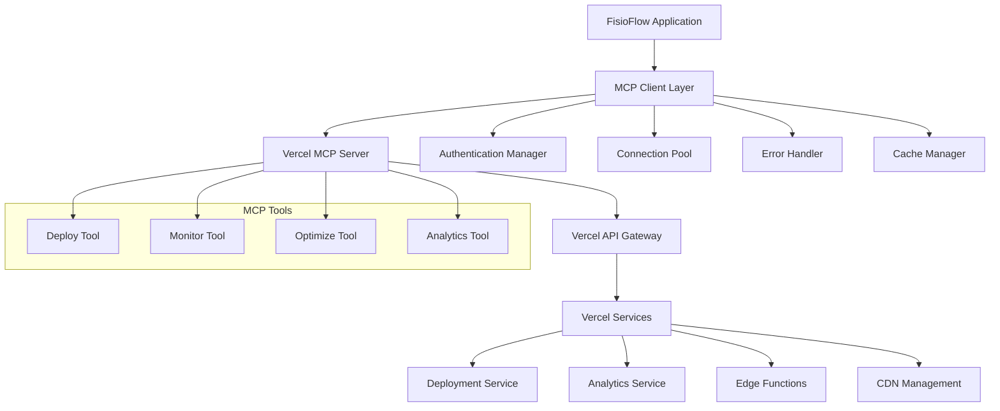

# Design Document

## Overview

This design document outlines the implementation of Model Context Protocol (MCP) integration with Vercel for the FisioFlow 2.0 system. The solution provides a comprehensive framework for programmatic interaction with Vercel's deployment, monitoring, and optimization services through MCP, enabling automated deployment management, real-time performance monitoring, and intelligent optimization recommendations.

The design follows MCP best practices for secure, scalable, and maintainable integration while leveraging Vercel's advanced features for optimal application performance and developer experience.

## Architecture

### MCP Integration Architecture

The MCP integration follows a layered architecture pattern:



### Core Components

1. **MCP Client Layer**: Manages communication with Vercel MCP server
2. **Authentication Manager**: Handles secure credential management and token rotation
3. **Connection Pool**: Maintains efficient connections with retry logic
4. **Tool Registry**: Registers and manages available MCP tools
5. **Event System**: Handles real-time events and notifications
6. **Cache Manager**: Optimizes API calls and data retrieval

## Components and Interfaces

### 1. MCP Client Configuration

#### Core MCP Client Interface
```typescript
interface VercelMCPClient {
  // Connection management
  connect(): Promise<void>;
  disconnect(): Promise<void>;
  isConnected(): boolean;
  
  // Tool execution
  executeTool(toolName: string, params: ToolParams): Promise<ToolResult>;
  listTools(): Promise<ToolDefinition[]>;
  
  // Event handling
  on(event: MCPEvent, handler: EventHandler): void;
  off(event: MCPEvent, handler: EventHandler): void;
  
  // Health monitoring
  getHealth(): Promise<HealthStatus>;
  getMetrics(): Promise<MCPMetrics>;
}

interface MCPConfiguration {
  server: {
    command: string;
    args: string[];
    env: Record<string, string>;
  };
  
  authentication: {
    tokenPath: string;
    refreshInterval: number;
    autoRotate: boolean;
  };
  
  connection: {
    timeout: number;
    retryAttempts: number;
    backoffStrategy: 'exponential' | 'linear';
    keepAlive: boolean;
  };
  
  tools: {
    autoApprove: string[];
    disabled: string[];
    rateLimit: RateLimitConfig;
  };
}
```

#### Authentication and Security
```typescript
interface VercelAuthManager {
  // Token management
  getToken(): Promise<string>;
  refreshToken(): Promise<string>;
  validateToken(token: string): Promise<boolean>;
  
  // Security
  encryptCredentials(credentials: Credentials): string;
  decryptCredentials(encrypted: string): Credentials;
  
  // Audit
  logAccess(operation: string, result: 'success' | 'failure'): void;
  getAuditLog(): Promise<AuditEntry[]>;
}

interface Credentials {
  vercelToken: string;
  teamId?: string;
  projectId: string;
  environment: 'development' | 'preview' | 'production';
}
```

### 2. Vercel MCP Tools

#### Deployment Management Tool
```typescript
interface DeploymentTool {
  name: 'vercel-deploy';
  description: 'Manage Vercel deployments';
  
  methods: {
    deploy: {
      params: DeploymentParams;
      returns: DeploymentResult;
    };
    
    getStatus: {
      params: { deploymentId: string };
      returns: DeploymentStatus;
    };
    
    rollback: {
      params: { deploymentId: string };
      returns: RollbackResult;
    };
    
    listDeployments: {
      params: ListDeploymentsParams;
      returns: DeploymentList;
    };
  };
}

interface DeploymentParams {
  branch?: string;
  environment: 'preview' | 'production';
  buildCommand?: string;
  environmentVariables?: Record<string, string>;
  regions?: string[];
  functions?: FunctionConfig[];
}

interface DeploymentResult {
  deploymentId: string;
  url: string;
  status: 'queued' | 'building' | 'ready' | 'error';
  createdAt: string;
  buildLogs?: string[];
}
```

#### Performance Monitoring Tool
```typescript
interface MonitoringTool {
  name: 'vercel-monitor';
  description: 'Monitor application performance and health';
  
  methods: {
    getMetrics: {
      params: MetricsParams;
      returns: PerformanceMetrics;
    };
    
    getAnalytics: {
      params: AnalyticsParams;
      returns: AnalyticsData;
    };
    
    setAlerts: {
      params: AlertConfig;
      returns: AlertResult;
    };
    
    getErrors: {
      params: ErrorParams;
      returns: ErrorReport;
    };
  };
}

interface PerformanceMetrics {
  coreWebVitals: {
    lcp: number; // Largest Contentful Paint
    fid: number; // First Input Delay
    cls: number; // Cumulative Layout Shift
  };
  
  customMetrics: {
    loadTime: number;
    timeToInteractive: number;
    bundleSize: number;
    cacheHitRate: number;
  };
  
  serverMetrics: {
    responseTime: number;
    errorRate: number;
    throughput: number;
    availability: number;
  };
}
```

#### Optimization Tool
```typescript
interface OptimizationTool {
  name: 'vercel-optimize';
  description: 'Optimize application performance and resources';
  
  methods: {
    analyzeBundle: {
      params: BundleAnalysisParams;
      returns: BundleAnalysis;
    };
    
    optimizeImages: {
      params: ImageOptimizationParams;
      returns: OptimizationResult;
    };
    
    configureCaching: {
      params: CacheConfig;
      returns: CacheResult;
    };
    
    getSuggestions: {
      params: OptimizationParams;
      returns: OptimizationSuggestions;
    };
  };
}

interface OptimizationSuggestions {
  performance: PerformanceSuggestion[];
  security: SecuritySuggestion[];
  cost: CostOptimization[];
  seo: SEORecommendation[];
}
```

### 3. Event System and Real-time Updates

#### Event Management
```typescript
interface MCPEventSystem {
  // Event subscription
  subscribe(event: MCPEventType, handler: EventHandler): Subscription;
  unsubscribe(subscription: Subscription): void;
  
  // Event emission
  emit(event: MCPEvent): void;
  
  // Event filtering
  filter(predicate: EventPredicate): EventStream;
  
  // Event persistence
  getEventHistory(params: HistoryParams): Promise<MCPEvent[]>;
}

interface MCPEvent {
  id: string;
  type: MCPEventType;
  timestamp: string;
  source: 'deployment' | 'monitoring' | 'optimization';
  data: EventData;
  severity: 'info' | 'warning' | 'error' | 'critical';
}

type MCPEventType = 
  | 'deployment.started'
  | 'deployment.completed'
  | 'deployment.failed'
  | 'performance.threshold_exceeded'
  | 'error.rate_increased'
  | 'optimization.suggestion_available'
  | 'cache.invalidated'
  | 'security.alert';
```

### 4. Configuration Management

#### Environment-Specific Configuration
```typescript
interface EnvironmentConfig {
  development: {
    vercel: {
      projectId: string;
      teamId?: string;
      previewBranches: string[];
    };
    
    mcp: {
      logLevel: 'debug' | 'info' | 'warn' | 'error';
      enableMockMode: boolean;
      cacheEnabled: false;
    };
  };
  
  production: {
    vercel: {
      projectId: string;
      teamId?: string;
      regions: string[];
      functions: FunctionConfig[];
    };
    
    mcp: {
      logLevel: 'warn' | 'error';
      enableMockMode: false;
      cacheEnabled: true;
      cacheTTL: number;
    };
  };
}

interface MCPServerConfig {
  command: 'uvx';
  args: ['vercel-mcp-server@latest'];
  env: {
    VERCEL_TOKEN: string;
    VERCEL_PROJECT_ID: string;
    VERCEL_TEAM_ID?: string;
    MCP_LOG_LEVEL: string;
  };
  disabled: false;
  autoApprove: string[];
}
```

## Data Models

### Deployment Data Models
```typescript
interface Deployment {
  id: string;
  url: string;
  name: string;
  source: 'git' | 'cli' | 'api';
  state: 'BUILDING' | 'ERROR' | 'INITIALIZING' | 'QUEUED' | 'READY' | 'CANCELED';
  type: 'LAMBDAS';
  created: number;
  creator: {
    uid: string;
    email: string;
    username: string;
  };
  meta: {
    githubCommitSha?: string;
    githubCommitMessage?: string;
    githubCommitAuthorName?: string;
    githubCommitRef?: string;
  };
  target: 'production' | 'staging' | null;
  aliasAssigned: boolean;
  aliasError?: {
    code: string;
    message: string;
  };
}

interface DeploymentBuild {
  id: string;
  deploymentId: string;
  entrypoint: string;
  readyState: 'INITIALIZING' | 'ANALYZING' | 'BUILDING' | 'UPLOADING' | 'DEPLOYING' | 'READY' | 'ERROR';
  readyStateAt: number;
  output: BuildOutput[];
}
```

### Analytics Data Models
```typescript
interface AnalyticsData {
  timeseries: {
    timestamp: number;
    requests: number;
    bandwidth: number;
    cache: {
      hit: number;
      miss: number;
      bypass: number;
    };
    status: {
      '2xx': number;
      '3xx': number;
      '4xx': number;
      '5xx': number;
    };
  }[];
  
  summary: {
    totalRequests: number;
    totalBandwidth: number;
    averageResponseTime: number;
    cacheHitRate: number;
    errorRate: number;
  };
  
  topPages: {
    path: string;
    requests: number;
    bandwidth: number;
  }[];
  
  topCountries: {
    country: string;
    requests: number;
  }[];
}
```

### Performance Data Models
```typescript
interface PerformanceReport {
  id: string;
  deploymentId: string;
  timestamp: string;
  
  coreWebVitals: {
    lcp: {
      value: number;
      rating: 'good' | 'needs-improvement' | 'poor';
      percentile: number;
    };
    fid: {
      value: number;
      rating: 'good' | 'needs-improvement' | 'poor';
      percentile: number;
    };
    cls: {
      value: number;
      rating: 'good' | 'needs-improvement' | 'poor';
      percentile: number;
    };
  };
  
  lighthouse: {
    performance: number;
    accessibility: number;
    bestPractices: number;
    seo: number;
    pwa: number;
  };
  
  recommendations: OptimizationRecommendation[];
}
```

## Error Handling

### MCP Connection Error Handling
```typescript
interface MCPErrorHandler {
  // Connection errors
  handleConnectionError(error: ConnectionError): Promise<void>;
  handleTimeoutError(error: TimeoutError): Promise<void>;
  handleAuthenticationError(error: AuthError): Promise<void>;
  
  // Tool execution errors
  handleToolError(toolName: string, error: ToolError): Promise<void>;
  handleRateLimitError(error: RateLimitError): Promise<void>;
  
  // Recovery strategies
  attemptReconnection(): Promise<boolean>;
  fallbackToCache(): Promise<any>;
  notifyUser(error: MCPError): void;
}

interface ErrorRecoveryStrategy {
  maxRetries: number;
  backoffMultiplier: number;
  fallbackEnabled: boolean;
  userNotification: boolean;
  
  // Specific strategies
  connectionLoss: 'reconnect' | 'fallback' | 'fail';
  rateLimitExceeded: 'queue' | 'delay' | 'skip';
  authenticationFailure: 'refresh' | 'reauth' | 'fail';
  toolExecutionError: 'retry' | 'fallback' | 'fail';
}
```

### Vercel API Error Handling
```typescript
interface VercelErrorHandler {
  // API errors
  handleAPIError(error: VercelAPIError): Promise<void>;
  handleDeploymentError(error: DeploymentError): Promise<void>;
  handleBuildError(error: BuildError): Promise<void>;
  
  // Service errors
  handleServiceUnavailable(): Promise<void>;
  handleQuotaExceeded(): Promise<void>;
  handlePermissionDenied(): Promise<void>;
  
  // Error reporting
  reportError(error: Error, context: ErrorContext): void;
  getErrorSuggestions(error: Error): string[];
}
```

## Testing Strategy

### MCP Integration Testing
```typescript
interface MCPTestSuite {
  // Connection testing
  testConnection(): Promise<TestResult>;
  testAuthentication(): Promise<TestResult>;
  testReconnection(): Promise<TestResult>;
  
  // Tool testing
  testToolExecution(toolName: string): Promise<TestResult>;
  testToolErrorHandling(toolName: string): Promise<TestResult>;
  
  // Performance testing
  testResponseTimes(): Promise<PerformanceTestResult>;
  testConcurrentConnections(): Promise<TestResult>;
  
  // Error scenario testing
  testNetworkFailure(): Promise<TestResult>;
  testRateLimiting(): Promise<TestResult>;
  testInvalidCredentials(): Promise<TestResult>;
}
```

### Deployment Testing
```typescript
interface DeploymentTestSuite {
  // Deployment flow testing
  testPreviewDeployment(): Promise<TestResult>;
  testProductionDeployment(): Promise<TestResult>;
  testRollbackDeployment(): Promise<TestResult>;
  
  // Performance validation
  testCoreWebVitals(): Promise<PerformanceTestResult>;
  testLoadTimes(): Promise<PerformanceTestResult>;
  testCacheEfficiency(): Promise<TestResult>;
  
  // Integration testing
  testSupabaseIntegration(): Promise<TestResult>;
  testEnvironmentVariables(): Promise<TestResult>;
  testSecurityHeaders(): Promise<TestResult>;
}
```

## Security Considerations

### Credential Management
```typescript
interface SecureCredentialManager {
  // Encryption
  encryptToken(token: string): string;
  decryptToken(encryptedToken: string): string;
  
  // Storage
  storeCredentials(credentials: Credentials): Promise<void>;
  retrieveCredentials(): Promise<Credentials>;
  
  // Rotation
  rotateToken(): Promise<string>;
  validateTokenExpiry(): Promise<boolean>;
  
  // Audit
  logCredentialAccess(operation: string): void;
  getCredentialAuditLog(): Promise<AuditEntry[]>;
}
```

### Access Control
```typescript
interface MCPAccessControl {
  // Role-based access
  checkPermission(user: User, operation: string): boolean;
  grantPermission(user: User, permission: Permission): void;
  revokePermission(user: User, permission: Permission): void;
  
  // Tool access control
  canExecuteTool(user: User, toolName: string): boolean;
  getAuthorizedTools(user: User): string[];
  
  // Audit logging
  logAccess(user: User, operation: string, result: 'granted' | 'denied'): void;
}
```

## Implementation Phases

### Phase 1: Core MCP Infrastructure
- Set up MCP client configuration and connection management
- Implement authentication and credential management
- Create basic error handling and retry logic
- Establish secure communication channels

### Phase 2: Deployment Management Tools
- Implement deployment tool with create, monitor, and rollback capabilities
- Add deployment status tracking and notifications
- Create deployment history and analytics
- Integrate with existing CI/CD workflows

### Phase 3: Performance Monitoring Integration
- Implement performance monitoring tool
- Add Core Web Vitals tracking and alerting
- Create performance analytics dashboard
- Implement automated optimization suggestions

### Phase 4: Advanced Features and Optimization
- Add advanced caching strategies
- Implement intelligent resource optimization
- Create predictive performance analytics
- Add comprehensive security monitoring

### Phase 5: Documentation and Team Integration
- Create comprehensive documentation and guides
- Implement team collaboration features
- Add automated testing and validation
- Establish monitoring and alerting procedures

## Performance Optimization

### Connection Optimization
```typescript
interface ConnectionOptimization {
  pooling: {
    maxConnections: number;
    idleTimeout: number;
    connectionTimeout: number;
  };
  
  caching: {
    responseCache: boolean;
    cacheTTL: number;
    cacheSize: number;
  };
  
  compression: {
    enabled: boolean;
    algorithm: 'gzip' | 'brotli';
    level: number;
  };
}
```

### API Optimization
```typescript
interface APIOptimization {
  batching: {
    enabled: boolean;
    maxBatchSize: number;
    batchTimeout: number;
  };
  
  rateLimit: {
    requestsPerSecond: number;
    burstLimit: number;
    queueSize: number;
  };
  
  caching: {
    strategy: 'cache-first' | 'network-first' | 'stale-while-revalidate';
    ttl: number;
    maxSize: number;
  };
}
```